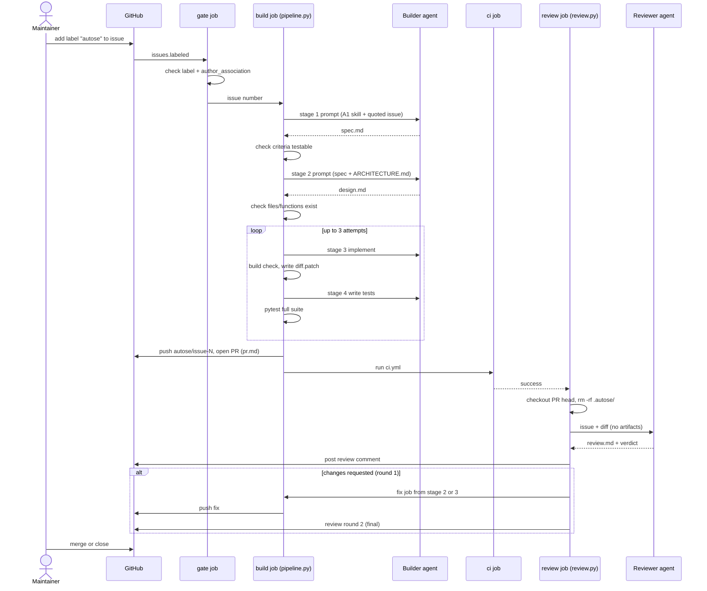

# Sequence view

Status: **planned sequence** — to be replaced by the trace of one real run (with Actions run, PR and review links) once it exists.

```mermaid
sequenceDiagram
  actor M as Maintainer
  participant GH as GitHub
  participant G as gate job
  participant B as build job (pipeline.py)
  participant BA as Builder agent
  participant C as ci job
  participant R as review job (review.py)
  participant RA as Reviewer agent

  M->>GH: add label "autose" to issue #N
  GH->>G: issues.labeled
  G->>G: check label + author_association
  G->>B: issue number
  B->>BA: stage 1 prompt (A1 skill + quoted issue)
  BA-->>B: spec.md
  B->>B: check criteria testable
  B->>BA: stage 2 prompt (spec + ARCHITECTURE.md)
  BA-->>B: design.md
  B->>B: check files/functions exist
  loop up to 3 attempts
    B->>BA: stage 3 implement
    B->>B: build check, write diff.patch
    B->>BA: stage 4 write tests
    B->>B: pytest full suite
  end
  B->>GH: push autose/issue-N, open PR (pr.md)
  B->>C: run ci.yml
  C-->>R: success
  R->>R: checkout PR head, rm -rf .autose/
  R->>RA: issue + diff (no artifacts)
  RA-->>R: review.md + verdict
  R->>GH: post review comment
  alt changes requested (round 1)
    R->>B: fix job from stage 2 or 3
    B->>GH: push fix
    R->>GH: review round 2 (final)
  end
  M->>GH: merge or close
```
